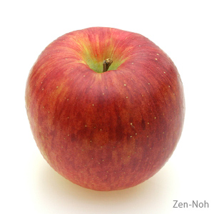

<!DOCTYPE html>
<html>
  <head>
     <title>Hello Japanet Takada!</title>
     <meta charset="utf-8">
     <meta name="description" content="POPをネット表示しちゃいまっせw">
     <meta name="viewport" content="width=device-width, initial-scale=1.0">
     <link rel="stylesheet" href="style.css">
  </head>
  <body>
     <!-- ヘッダー -->
     <header>
         <!-- 1ロゴ -->
         <a href="index.html" id="logo"><nav>おすすめ料理URL!</nav></a>
     </header>
     <main>
         <article>
              <!-- メインビジュアル -->
              <section id="main-visual">
                 

                    <h1>今日はこれ！！</h1>
                 

                 
              </section>
         </article>
         <footer>
            

              <h1>軽減税率</h1>
            

            

              
              
              
               &copy;2022 Japanet Takada 
            

          </footer>
     </main>
  </body>  
</html>

<!-- https://terakoya.sejuku.net/programs/54/chapters/630 -->
<!-- 2.2 模写コーディングを始める前の確認事項 -->